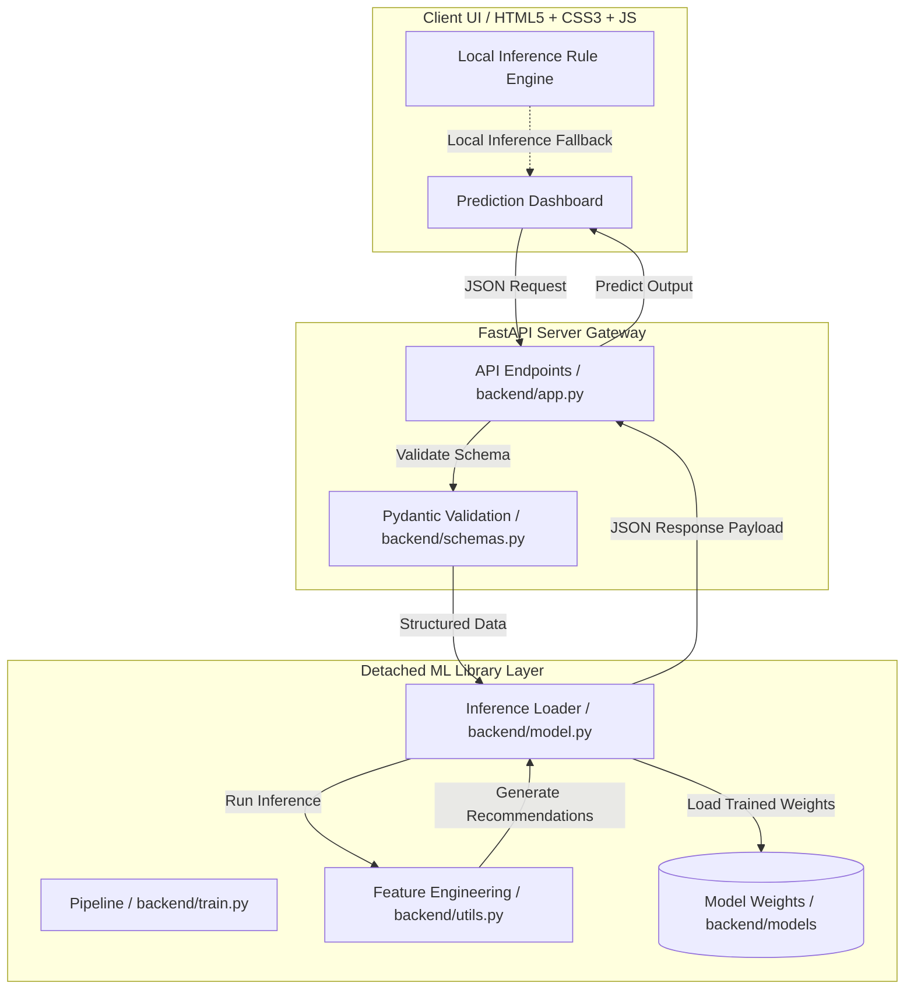

# 🧠 HealthOracle AI — Clinical Pre-Screening Suite
### *Predict Before It Hurts* — v4.0 Hospital Grade

[](https://gitlab.com)
[](https://python.org)
[](file:///c:/Users/Ramakrishna/OneDrive/Desktop/H/healthoracle-ai/LICENSE)
[](https://github.com/astral-sh/ruff)
[](https://github.com/python/mypy)
[](https://github.com/gitleaks/gitleaks)

---

## 📌 Overview
**HealthOracle AI** is an intelligent health risk prediction system that analyzes patient data (symptoms, lifestyle, biometrics, lab values) to **predict Diabetes and Cardiovascular disease risk** with ML-powered confidence scores and clinical recommendations. 

The application utilizes a detached, modular machine learning library for data ingestion, synthetic augmentation, and model training, which can be run independently from the FastAPI API layer.

---

## 🔗 Live Demo
Visit the live deployment here: [healthoracle-ai-1.onrender.com](https://healthoracle-ai-1.onrender.com)

---

## 🏗 System Architecture



---

## 🛠 Tech Stack

| Layer | Technology | Description |
| :--- | :--- | :--- |
| **Frontend** | HTML5, Vanilla CSS, Vanilla JS | Apple-inspired glassmorphism, responsive, zero external frameworks |
| **Backend** | Python · FastAPI · Uvicorn | High-performance, async-ready REST API |
| **ML Models** | scikit-learn | VotingClassifier Ensemble (Random Forest + Gradient Boosting + LR) |
| **Class Balance**| SMOTE (imbalanced-learn) | Resampling synthetic health data for minority classes |
| **Feature Scaling**| StandardScaler | Preserved and loaded alongside models in joblib format |

---

## 📂 Project Structure

```
HealthOracle-AI/
│
├── backend/
│   ├── __init__.py        # Python package marker
│   ├── app.py             # FastAPI entry point + CORS + endpoints
│   ├── model.py           # ML model singleton loader + prediction
│   ├── schemas.py         # Pydantic request/response schemas
│   ├── train.py           # Training pipeline (real data + synthetic)
│   ├── utils.py           # Feature engineering + recommendations
│   └── models/            # Trained .pkl files (auto-generated)
│       ├── diabetes_model.pkl
│       ├── diabetes_scaler.pkl
│       ├── heart_model.pkl
│       ├── heart_scaler.pkl
│       └── model_meta.json
│
├── dataset/               # Auto-generated training datasets
│   ├── diabetes_training.csv
│   └── heart_training.csv
│
├── frontend/
│   ├── index.html         # Main app shell (3-step form + results dashboard)
│   ├── styles.css         # Apple-inspired glassmorphism dark UI
│   └── script.js          # Form logic + local inference fallback + API calls
│
├── .gitlab-ci.yml         # Continuous Integration configuration
├── .pre-commit-config.yaml # Pre-commit hook definitions
├── pyproject.toml         # Python tool configurations (Ruff, Mypy, Vulture, Pylint, etc.)
├── requirements.txt       # Production dependencies
└── README.md              # Project onboarding & setup manual
```

---

## ⚡ Developer Onboarding & Quick Start

### 1. Prerequisites
- **Python 3.11+** installed on your system.
- **Git** version control system.

### 2. Setup Virtual Environment
Clone the repository and navigate to the root directory. Then create and activate a Python virtual environment:

```bash
# Create virtual environment
python -m venv .venv

# Activate on Windows (cmd)
.venv\Scripts\activate.bat

# Activate on Windows (PowerShell)
.venv\Scripts\Activate.ps1

# Activate on macOS/Linux
source .venv/bin/activate
```

### 3. Install Dependencies
Install all core application dependencies and test utilities:

```bash
pip install --upgrade pip
pip install -r requirements.txt
pip install pytest pytest-cov httpx ruff mypy types-requests types-urllib3 vulture bandit pylint flake8 semgrep
```

### 4. Initialize Pre-Commit Hooks
Ensure that your changes automatically conform to quality standards before making commits:

```bash
pre-commit install
```

### 5. Train the Machine Learning Models
Execute the decoupled training script to pull datasets, augment them using synthetic generators, and fit models:

```bash
python backend/train.py
```
This training pipeline will:
- Ingest real **PIMA Indians Diabetes** and **UCI Heart Disease** datasets.
- Generate **2,000 synthetic patient rows** per model mapping real-world clinical correlations.
- Train the **Soft-Voting Ensemble Classifier** (Random Forest, Gradient Boosting, calibrated Logistic Regression).
- Export serialization files and scaler metadata directly to `backend/models/`.

### 6. Run the REST API Gateway
Start the FastAPI server:

```bash
uvicorn backend.app:app --reload --host 127.0.0.1 --port 8000
```
Visit the Swagger UI API Documentation at [http://127.0.0.1:8000/docs](http://127.0.0.1:8000/docs).

### 7. Launch Frontend Dashboard
Open `frontend/index.html` in your browser. The connection pill in the header will turn green indicating a successful connection to the backend.

---

## 🧪 Quality Assurance & Testing

### Running Tests
To run unit and integration tests with coverage details:
```bash
pytest --cov=backend --cov-report=term-missing tests/
```

### Static Analysis & Linters
Run individual checks locally using the custom configuration files in the root:

*   **Ruff (Linter & Formatter)**:
    ```bash
    ruff check backend/ tests/
    ruff format --check backend/ tests/
    ```
*   **Mypy (Type Safety)**:
    ```bash
    mypy backend/ tests/
    ```
*   **Vulture (Dead Code Detection)**:
    ```bash
    vulture backend/
    ```
*   **Bandit (Security Linting)**:
    ```bash
    bandit -r backend/ -c bandit.yaml
    ```
*   **Pylint (Code Quality)**:
    ```bash
    pylint backend/
    ```
*   **Flake8 (Style Violations)**:
    ```bash
    flake8 backend/
    ```
*   **Semgrep (Static SAST Scanning)**:
    ```bash
    semgrep --config=.semgrep.yaml backend/
    ```

---

## 🤖 CI/CD Pipeline Stages
Our GitLab CI configuration (`.gitlab-ci.yml`) enforces the following sequence:

1.  **test**: Runs all test suites via `pytest`.
2.  **lint**: Runs Ruff code quality checks.
3.  **format**: Verifies Ruff-compliant code formatting.
4.  **type_check**: Evaluates strict static type definitions via `mypy`.
5.  **coverage**: Checks code test coverage thresholds.

---

## ⚠️ Clinical Disclaimer
HealthOracle AI is a **clinical pre-screening tool for educational and early awareness purposes only**.  
It is **NOT** a substitute for professional medical advice, diagnosis, or treatment.  
If you are experiencing emergency symptoms (e.g., severe chest pain or breathlessness), please contact emergency services immediately.

---

## 👨‍💻 Authors & Governance
HealthOracle AI Project · 2026 · Clinical Software Compliance Edition.
All modifications to the clinical Pydantic models or schemas must be documented.
